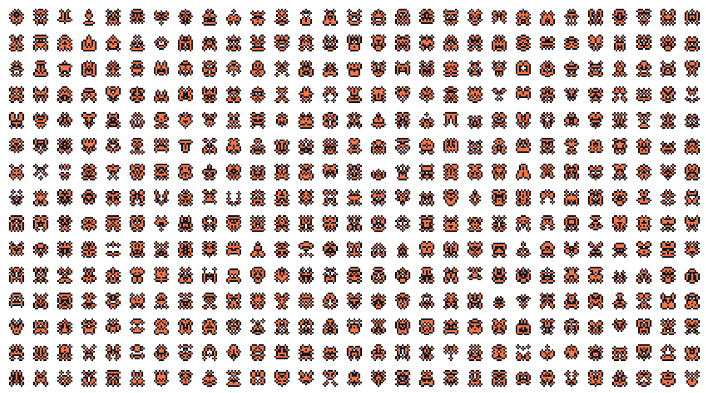

# Avatarro

A simple avatar generator based on the idea of [yurkth](https://github.com/yurkth/sprator).

I found it much simpler to just create a noise and not to do some cellular automata as postpressing.
Depending on the random function the results are incredible different.

For this quick release only HTML tables are rendered, but it is kept open to enhance for more renderers.

